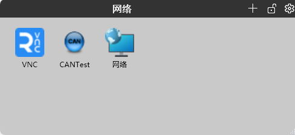
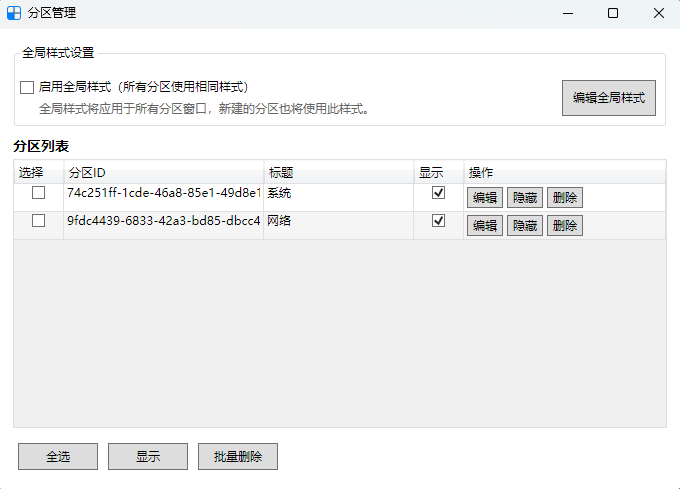

<h1>Layouter</h1>

English | <a href="./readme_cn.md">中文</a> 

A simple, easy-to-use and beautiful desktop organization software, developed based on .net 8, supporting Windows 7 and above operating systems.

## Features

- **Always on the desktop**: Desktop level window, even if you click "Show Desktop" and it still displays on the desktop, the same is true on windows 11
- **Support widely**: Supports interactive operation of any desktop icon, including Shell icon, saving your time
- **Layout easily**: Support auto-alignment and auto-snap effect to help you layout windows easily
- **Flexible customization**: Flexible style customization, change the window style at will
- **Simple and quiet**: Simple、quiet and non-intrusive, use it with confidence

## Shortcuts

- Desktop window  

- Manage window  

- Tray Menu  

## What is being planned for next version

- Support for plugins
- Support config backup

## Feedback

Issues and suggestions are welcome.

## License

[Apache-2.0 license](../LICENSE)